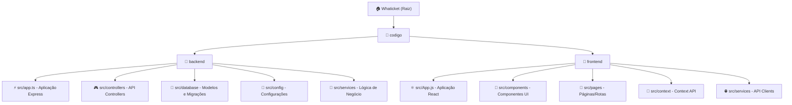

# Whaticket - Sistema de Atendimento WhatsApp

## Change Log (Changelog)

### 2025-09-01 19:03:42 - Inicialização Completa do Contexto de IA
- Criado contexto de IA completo do projeto
- Identificados 2 módulos principais: backend (TypeScript/Express) e frontend (React)
- Mapeada arquitetura baseada em sistema de tickets WhatsApp multi-empresa
- Configurado sistema de documentação modular

## Visão do Projeto

**Whaticket** é um sistema completo de atendimento via WhatsApp com funcionalidades avançadas de gestão de tickets, campanhas e multi-empresas. O sistema permite centralizar o atendimento de múltiplas conexões WhatsApp, com recursos como:

- **Gestão Multi-Empresa**: Suporte a múltiplas empresas/clientes
- **Sistema de Tickets**: Controle completo de atendimentos
- **Campanhas**: Envio de mensagens em massa e campanhas programadas
- **Filas de Atendimento**: Distribuição inteligente de tickets
- **Dashboard**: Analytics e métricas de atendimento
- **Integração WhatsApp**: Usando biblioteca Baileys para conexão direta
- **Sistema de Pagamento**: Integração com Gateway de Pagamento (Gerencianet)

## Visão Geral da Arquitetura

### Stack Principal
- **Backend**: Node.js + TypeScript + Express + Socket.IO
- **Frontend**: React 17 + Material-UI + Socket.IO Client
- **Banco de Dados**: PostgreSQL/MySQL com Sequelize ORM
- **WhatsApp**: @whiskeysockets/baileys (conexão direta)
- **Tempo Real**: Socket.IO para comunicação bidirecional
- **Autenticação**: JWT com refresh tokens

### Padrões Arquiteturais
- **MVC**: Model-View-Controller no backend
- **Component-Based**: Arquitetura de componentes React no frontend
- **Real-time**: Comunicação em tempo real via WebSockets
- **Multi-tenant**: Suporte a múltiplas empresas
- **Queue System**: Sistema de filas com Bull (Redis)

## Diagrama da Estrutura de Módulos



## Índice de Módulos

| Módulo | Caminho | Tipo | Responsabilidade | Status |
|--------|---------|------|------------------|--------|
| **backend** | [`codigo/backend`](./codigo/backend/CLAUDE.md) | TypeScript/Express API | API backend, gestão de dados, integração WhatsApp, sistema de tickets | ✅ Ativo |
| **frontend** | [`codigo/frontend`](./codigo/frontend/CLAUDE.md) | React SPA | Interface web, dashboard, gestão de atendimento | ✅ Ativo |

## Execução e Desenvolvimento

### Pré-requisitos
```bash
# Versões recomendadas
Node.js >= 16.x
npm ou yarn
PostgreSQL ou MySQL
Redis (para filas)
```

### Backend
```bash
cd codigo/backend
npm install
npm run db:migrate
npm run db:seed
npm run dev:server
```

### Frontend
```bash
cd codigo/frontend
npm install
npm start
```

### Portas Padrão
- **Backend**: 3000 (API)
- **Frontend**: 3001 (Interface Web)
- **WebSocket**: 3000 (Socket.IO)

## Estratégia de Testes

### Backend
- **Framework**: Jest + ts-jest
- **Cobertura**: Configurada para `src/services/**/*.ts`
- **Tipos**: Unit tests em `__tests__/**/*.spec.ts`
- **Comandos**: `npm test` (com setup/teardown de DB)

### Frontend
- **Framework**: React Testing Library + Jest
- **Tipos**: Component tests, integration tests
- **Configuração**: Via react-scripts

## Padrões de Código

### Backend (TypeScript)
- **Linting**: ESLint + Prettier
- **Estrutura**: Controllers → Services → Models
- **Async/Await**: Preferred over Promises
- **Error Handling**: Custom AppError class

### Frontend (JavaScript/React)
- **Hooks**: Functional components preferred
- **State Management**: Context API + React Query
- **Styling**: Material-UI + styled-components
- **Theme**: Light/Dark mode support

## Diretrizes de Uso de IA

### Para Desenvolvimento
1. **Contexto Modular**: Cada módulo possui documentação específica
2. **Padrões Estabelecidos**: Seguir arquitetura MVC/Component-based existente
3. **Integrações**: Considerar Socket.IO para features em tempo real
4. **Database**: Usar migrations Sequelize para mudanças no schema

### Para Debugging
1. **Logs**: Sistema de logs com Pino (backend)
2. **Error Tracking**: Sentry configurado
3. **Development**: Hot reload habilitado em ambos módulos

### Para Novas Features
1. **API First**: Definir endpoints no backend primeiro
2. **Real-time**: Considerar eventos Socket.IO necessários
3. **Multi-tenant**: Sempre considerar companyId nos modelos
4. **Permissions**: Sistema de perfis/permissões implementado

## Change Log (Changelog)

### [6.0.0] - 2025-09-01
#### Adicionado
- Documentação completa do contexto de IA
- Mapeamento da arquitetura de módulos
- Diagrama Mermaid da estrutura do projeto
- Documentação de padrões e diretrizes

#### Técnico
- Identificado uso de Baileys para integração WhatsApp
- Mapeado sistema de multi-empresa
- Documentado stack tecnológico completo
- Configuração de testes e linting mapeada